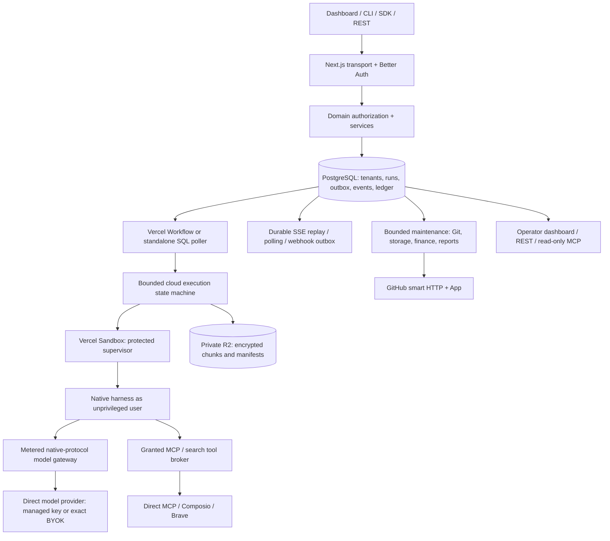

# Implemented architecture and data ownership

This is the current design; [decision log](decisions.md) explains changes from the initial proposal. [Verification](../status/README.md) distinguishes local acceptance from live-provider checks.

[Future architecture improvements](future-improvements.md) evaluates Vercel Workflow and Temporal for persistent agent coordination, with explicit criteria for revisiting the current scheduler.

## Technology decisions

| Responsibility        | Implementation                                                         | Why / tradeoff                                                                                                       |
| --------------------- | ---------------------------------------------------------------------- | -------------------------------------------------------------------------------------------------------------------- |
| App, API, public docs | Next.js 16, React 19, Node 24, TypeScript                              | One same-origin deployment, established ecosystem, standalone build; serverless duration/body limits remain explicit |
| UI                    | Radix primitives, Lucide, TanStack Query/Table, CodeMirror, custom CSS | Accessible established controls with a cohesive visual system; no second dashboard framework                         |
| Contracts             | OpenAPI 3.1, AJV, Zod, openapi-typescript, Scalar                      | Reviewed HTTP schema is authoritative; typed clients and runtime validation share it                                 |
| Database              | PostgreSQL 17, node-postgres, numbered SQL migrations; Neon first      | Explicit locks, RLS and balanced journals are reviewable together; no redundant ORM schema                           |
| Scheduling            | Vercel Workflow; PostgreSQL outbox and leases                          | Managed wakeups with application-owned recovery; standalone SQL poller reuses the same state machine                 |
| Agent isolation       | Vercel Sandbox, immutable VCR image; Docker for local development                                    | Managed microVM isolation; no untrusted code in a Function or shared worker process                                  |
| Harnesses             | Native Codex app-server, Claude Agent SDK, OpenCode SDK                | Exact sessions/tools/input semantics; more adapter maintenance than an experimental universal wrapper                |
| Files                 | Encrypted content-addressed chunks and manifests in private R2         | Portable independent recovery and file browsing; owned reachability/retention logic instead of restic processes      |
| Identity              | Better Auth email/password, MFA, OAuth provider                        | Established identity protocols; domain owns memberships, API keys and authorization                                  |
| Integrations          | Official MCP SDK, optional Composio, Octokit GitHub App, Brave         | Reuse protocols and tools while retaining current-user grants and spending authority                                 |
| Commerce              | Stripe, SQL prepaid ledger/credit lots                                 | Provider owns payments; application owns admission and usage, with reconciliation                                    |
| Clients               | oclif + Ink CLI, TypeScript SDK, Python/httpx SDK                      | Same public API and stream contract; no client database access                                                       |
| Operations            | Indexed SQL facts, stored reports, optional PostHog                    | Native reports need no analytics subscription or inference                                                           |

Exact versions are in the lockfile and runtime package. pnpm workspaces are sufficient; Turborepo, Redis, Kubernetes, a data warehouse, Vercel Connect and Vercel AI Gateway are not required launch services. The local Docker adapter shares the SQL poller and phase engine; hosted alternatives still require adapter and acceptance work. See [development modes](../engineering/development-modes.md).

## Component graph

## Module boundaries

`apps/web` owns rendering and request transport. `packages/core/src` owns services and domain ports; `api-handlers.ts` maps operations, `http.ts` enforces shared authorization/idempotency/request recording. `packages/db` owns schema and transaction context. `packages/providers` implements machine, network, storage and Git boundaries. `packages/runtime` is a separately built Linux trust boundary. `packages/cli` and `sdk` never import server database/auth internals. `apps/web/workflows` calls bounded domain steps.

This is a modular application, not dozens of independently deployed services. Some provider composition is intentionally adjacent to domain services (for example the model gateway and connection implementation); the machine and object-store ports carry the critical hosting/persistence boundary. Do not claim every vendor can be replaced without implementation changes.

## Durable transaction sequence

Admission resolves and freezes model/harness/rate/grants/limits, authorizes the tenant and credential, takes workspace/account locks, reserves maximum liability, creates the run/session, writes its first event and inserts its dispatch record in one transaction. A transport response does not own the run. Immediate Workflow dispatch is repaired by authenticated minutely cron. Duplicate scheduler instances compete for a phase lease. Stable VM identity and a native launch marker prevent a lost acknowledgement from replaying the prompt.

A cloud step restores, launches, probes or uploads a bounded part of a checkpoint and commits its next phase. It returns a delay; Workflow sleeps durably, while the standalone worker reschedules a SQL job. Native processes outlive an individual HTTP request. SSE reads durable event batches, releases database connections between reads and rotates after 55 seconds. POST input/cancel and session continuation are ordinary authenticated mutations. WebSockets are not required for this product's interaction model.

Completion has separate execution, persistence and Git-sync outcomes. The supervisor stops native writers before final capture. The control plane verifies every chunk and full-file hash before publishing a checkpoint, settling the run and queuing independent notifications/sync. A failed agent can have successfully preserved files. A successful agent with failed persistence is not reported as fully durable.

## Data model and tenant isolation

[Dashboard freshness](../features/dashboard/live-refresh.md) uses a separate private SSE path. Indexed current resource revisions are checked through short tenant transactions shared by tabs on each instance. A category signal invalidates queries without copying output into an organization event log. Periodic reconciliation repairs missed hints; persisted per-run replay remains authoritative for history.

The actual numbered migrations, beginning with `packages/db/001_initial.sql`, are the field-level schema. Better Auth tables live in `auth`; tenant application resources live in `public`. Core families are organizations/memberships/API keys; projects/workspaces/agents/sessions; runs/events/executions/jobs; checkpoints/artifacts/transfers/operations; connections/grants/cleanup; Git installations/grants/jobs; webhooks/deliveries; ledger/credit lots/financial and billing events/model usage; request/product/human-activity facts; maintenance/storage observations/report snapshots/admin audits.

Resources use opaque UUIDv7 IDs, timestamptz, bigint micro-USD and byte/token counts. Public bigints are decimal strings. Heterogeneous resource configuration uses JSONB; indexed lifecycle, financial and ownership fields remain relational. Uniqueness fences workspace branches, active writers, event producer sequences and payment/business-event deduplication. Queued follow-ups are not active writers.

The runtime login is a non-owner `NOBYPASSRLS` role. Each domain transaction sets `app.organization_id` using `SET LOCAL`, so pooled connections cannot retain another tenant's context. Tenant tables use FORCE RLS. Services still check nested resource ownership, scope, project restrictions and current membership. A supplied UUID is a selector, never authority. Connection grants additionally bind the upstream owner; accepted runs recheck revocation before model/tool calls.

Reporting views expose approved non-content columns through a dedicated NOLOGIN reporting role. The app cannot assume that role or issue arbitrary operator SQL through an endpoint. Public reporting methods are fixed queries with separate operator audiences/scopes and immutable access audits. PII requires `accounts:pii:read`. The overall application database login is not a read-only login; read-only behavior is enforced by the reporting surface and restricted views, not a misleading claim that the entire server has read-only database credentials.

The pool has at most five domain, three identity and two independent credential-refresh connections per process. Serverless instances multiply this number. Use managed pooling with transaction semantics intact and measure connection pressure before increasing concurrency. A shared tenant storage lock allows normal transactions together; exclusive destructive maintenance prevents concurrent reference publication/collection races.

## Failure and scaling boundaries

SQL is the source of truth, R2 holds independent encrypted bytes, the VM is replaceable execution capacity. Provider operational history is not the user's transcript. Missing usage remains provisional; unknown external writes remain ambiguous. No universal exactly-once guarantee is made.

Launch uses one region. Git/export operations have explicit 250 MiB and entry limits so they fit bounded Functions; large ignored runtime data uses chunked persistence. The runtime capture envelope is 10 GiB/100,000 entries. Exceeding it preserves a recovery state rather than inventing a successful backup. Larger repositories require an explicit maintenance-compute extension and fresh capacity evidence.

See [runtime](../features/execution/runtime.md), [workspace design](../features/workspaces/README.md), [security/tools](../features/identity-integrations/tools-security.md), [deployment](../operations/deployment.md) and [launch instructions](../operations/launch-guide.md) for the corresponding implementation and operator procedures.
