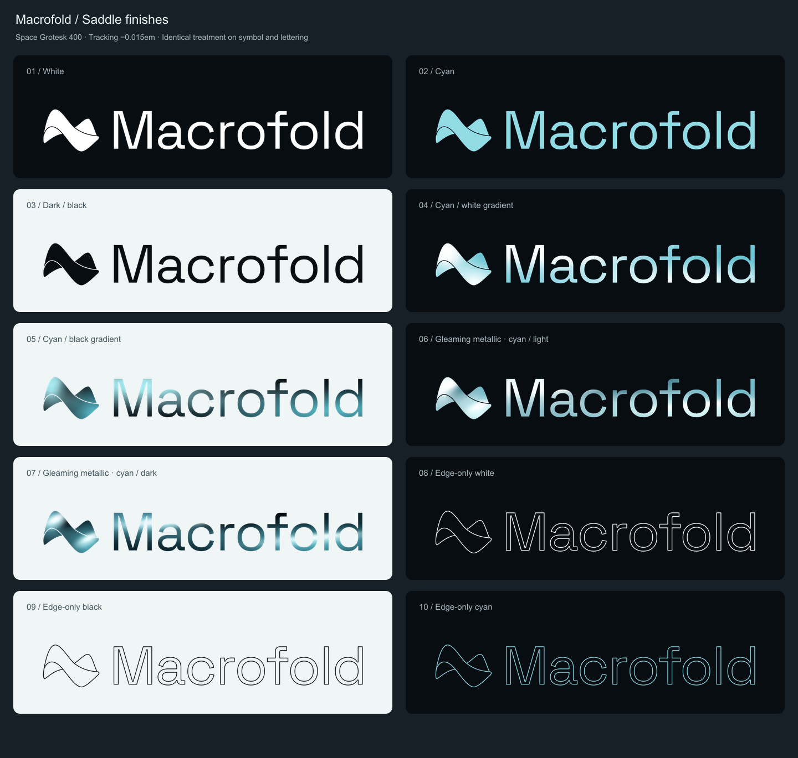

# Macrofold branding

The selected identity pairs the **Saddle** symbol with **Macrofold** in **Space Grotesk 400**, with **−0.015em letter spacing** and the font's own kerning.

## Download logos

Use a combined logo when the name should accompany the symbol. Use the symbol alone for compact placements, and the wordmark alone when a separate symbol is unnecessary. SVGs are editable vector masters with outlined lettering and no external font dependency. PNGs have transparent backgrounds at three times the SVG dimensions.

| Finish | Combined logo | Symbol | Wordmark |
| --- | --- | --- | --- |
| White | [SVG](saddle/svg/01-white-lockup.svg) · [PNG](saddle/png/01-white-lockup.png) | [SVG](saddle/svg/01-white-mark.svg) · [PNG](saddle/png/01-white-mark.png) | [SVG](saddle/svg/01-white-wordmark.svg) · [PNG](saddle/png/01-white-wordmark.png) |
| Cyan | [SVG](saddle/svg/02-cyan-lockup.svg) · [PNG](saddle/png/02-cyan-lockup.png) | [SVG](saddle/svg/02-cyan-mark.svg) · [PNG](saddle/png/02-cyan-mark.png) | [SVG](saddle/svg/02-cyan-wordmark.svg) · [PNG](saddle/png/02-cyan-wordmark.png) |
| Dark / black | [SVG](saddle/svg/03-black-lockup.svg) · [PNG](saddle/png/03-black-lockup.png) | [SVG](saddle/svg/03-black-mark.svg) · [PNG](saddle/png/03-black-mark.png) | [SVG](saddle/svg/03-black-wordmark.svg) · [PNG](saddle/png/03-black-wordmark.png) |
| Cyan / white gradient | [SVG](saddle/svg/04-cyan-white-lockup.svg) · [PNG](saddle/png/04-cyan-white-lockup.png) | [SVG](saddle/svg/04-cyan-white-mark.svg) · [PNG](saddle/png/04-cyan-white-mark.png) | [SVG](saddle/svg/04-cyan-white-wordmark.svg) · [PNG](saddle/png/04-cyan-white-wordmark.png) |
| Cyan / black gradient | [SVG](saddle/svg/05-cyan-black-lockup.svg) · [PNG](saddle/png/05-cyan-black-lockup.png) | [SVG](saddle/svg/05-cyan-black-mark.svg) · [PNG](saddle/png/05-cyan-black-mark.png) | [SVG](saddle/svg/05-cyan-black-wordmark.svg) · [PNG](saddle/png/05-cyan-black-wordmark.png) |
| Gleaming metallic · cyan / light | [SVG](saddle/svg/06-metallic-light-lockup.svg) · [PNG](saddle/png/06-metallic-light-lockup.png) | [SVG](saddle/svg/06-metallic-light-mark.svg) · [PNG](saddle/png/06-metallic-light-mark.png) | [SVG](saddle/svg/06-metallic-light-wordmark.svg) · [PNG](saddle/png/06-metallic-light-wordmark.png) |
| Gleaming metallic · cyan / dark | [SVG](saddle/svg/07-metallic-dark-lockup.svg) · [PNG](saddle/png/07-metallic-dark-lockup.png) | [SVG](saddle/svg/07-metallic-dark-mark.svg) · [PNG](saddle/png/07-metallic-dark-mark.png) | [SVG](saddle/svg/07-metallic-dark-wordmark.svg) · [PNG](saddle/png/07-metallic-dark-wordmark.png) |
| Edge-only white | [SVG](saddle/svg/08-outline-white-lockup.svg) · [PNG](saddle/png/08-outline-white-lockup.png) | [SVG](saddle/svg/08-outline-white-mark.svg) · [PNG](saddle/png/08-outline-white-mark.png) | [SVG](saddle/svg/08-outline-white-wordmark.svg) · [PNG](saddle/png/08-outline-white-wordmark.png) |
| Edge-only black | [SVG](saddle/svg/09-outline-black-lockup.svg) · [PNG](saddle/png/09-outline-black-lockup.png) | [SVG](saddle/svg/09-outline-black-mark.svg) · [PNG](saddle/png/09-outline-black-mark.png) | [SVG](saddle/svg/09-outline-black-wordmark.svg) · [PNG](saddle/png/09-outline-black-wordmark.png) |
| Edge-only cyan | [SVG](saddle/svg/10-outline-cyan-lockup.svg) · [PNG](saddle/png/10-outline-cyan-lockup.png) | [SVG](saddle/svg/10-outline-cyan-mark.svg) · [PNG](saddle/png/10-outline-cyan-mark.png) | [SVG](saddle/svg/10-outline-cyan-wordmark.svg) · [PNG](saddle/png/10-outline-cyan-wordmark.png) |

The backgrounds in the comparison sheet are for preview only. They are absent from the individual SVG and PNG files.

## Typography and fonts

- [Space Grotesk Regular, weight 400 — TTF](fonts/SpaceGrotesk-400.ttf): install for desktop design tools.
- [Space Grotesk Regular, weight 400 — WOFF2](fonts/SpaceGrotesk-400.woff2): embed for web typography.
- [Space Grotesk variable source — TTF](fonts/SpaceGrotesk-variable.ttf): retained for font editing and other weights; the wordmark uses 400.
- [SIL Open Font License and copyright notice](fonts/OFL.txt): keep with redistributed font files.

Use a capital **M** and lowercase **acrofold**. Set weight to **400**, tracking to **−0.015em**, and enable normal font kerning. The supplied wordmark paths already preserve these settings; use them when exact logo geometry matters.

The font source is [Space Grotesk in Google Fonts](https://github.com/google/fonts/tree/main/ofl/spacegrotesk), by the [Space Grotesk project](https://github.com/floriankarsten/space-grotesk). The regular TTF is a weight-400 instance of the bundled variable source; the WOFF2 is a conversion of that instance. Font files are distributed under SIL OFL 1.1.

## Color and material

- **White:** `#FFFFFF`, for dark surfaces.
- **Cyan:** `#91DBE5`, for the desaturated cyan identity.
- **Dark / black:** `#080D12`, for light surfaces.
- **Gradients:** overlapping, off-center cyan/white or cyan/black color blooms.
- **Metallic finishes:** the same organic fields with localized, angled gleams.
- **Edge-only finishes:** empty interiors with white, black, or cyan outlines.

Apply the same finish to the saddle and lettering. Preserve the logo's proportions, the complete foreground plane, and the rear-only separation gaps. The fold edges must meet the silhouette cleanly. Outline finishes need enough display size for the strokes and letter counters to remain legible; use a filled finish at small sizes.

The [asset manifest](saddle/manifest.json) records font settings, solid colors, and normalized bloom specifications. Each bloom lists center x/y, radii x/y, angle in degrees, color, opacity, and bright-core radius. Existing SVG definitions are the editable source for the final artwork.

## Asset scope

This folder contains the selected Saddle identity: 30 SVGs, 30 PNGs, the comparison sheet, color/type specifications, and the font files and license. Earlier logo explorations, generated reference images, prototype galleries, and duplicate ZIP archives are excluded.
