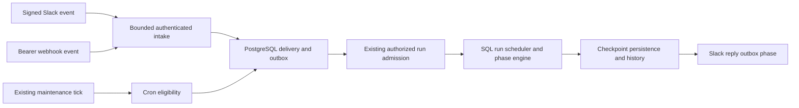

# Trigger architecture and operations

[User guide](README.md) · [Acceptance evidence](../../engineering/testing/triggers.md)

Triggers add durable intake to the existing execution path. They do not introduce another queue service, sandbox launcher, Workflow history loop, or agent streaming contract.

## Data and control flow

Migration 028 adds `triggers`, `slack_connections`, and `trigger_deliveries` with forced tenant row security. `trigger_routes` contains only IDs, organization IDs and integration kinds so unauthenticated ingress can find its tenant before validating a connection-specific secret. Prompts and credentials never enter this routing table or dispatch metadata. Credentials and incoming prompt content use the existing encrypted vault.

The existing `dispatch_jobs` table owns both `trigger_schedule` ticks and `trigger` receipts. Configuration and the next scheduled job commit together. Receipt identity, encrypted effective prompt, configuration revision and dispatch job commit together. Admission, financial reservation, one linked run and the receipt transition commit in one transaction. A process retry cannot admit a second run from an accepted receipt. A savepoint isolates admission rejections without losing the receipt or leaving a reservation behind.

`trigger-policy.ts` owns cron and Slack message/signature rules; `triggers.ts` owns authorized configuration; `trigger-ingress.ts` owns bounded inbound HTTP; `trigger-deliveries.ts` owns receipts and history; `trigger-dispatch.ts` composes the existing run admission and maintenance paths. The Slack provider adapter makes fixed-origin, bounded HTTP calls. Dashboard transport and SDK resources derive from OpenAPI; run output continues through existing SSE and replay.

## Authority and input limits

The preset and project are saved configuration, never trusted inbound parameters. All new runs recheck creator membership, API-key revocation/expiry/project scope, OAuth authority, preset/model/BYOK/grants, storage capacity and financial policy. Triggers created with OAuth credentials require unexpired access tokens for new admission, unlike the delegated lifetime of an already admitted run. Viewer access cannot create or change automation.

Slack connection credentials and channel discovery are creator-only and require an unrestricted organization credential with connection-management scope. Signed human messages in a configured channel are authorized to request work under that creator’s trigger; there is no inferred mapping from Slack users to Macrofold memberships. A trigger’s project is immutable so delivery history keeps its original authorization boundary. Pending deliveries fail when configuration revision changes.

Ingress bounds the raw body to 64 KiB, verifies Slack HMAC over exact bytes within a five-minute timestamp window, and handles Slack URL verification. Only human message/mention events for the connection’s team and configured channel are admitted. Channel/timestamp identity suppresses duplicate message and mention delivery. Webhooks require a separate bearer secret and explicit event idempotency key. Payloads cannot override execution configuration. Neither path logs prompts or credentials.

## Scheduling, budgets and recovery

Five-field cron uses pinned `cron-parser` 5.10.0 with an explicit timezone and a fresh parser for each next occurrence. SQL row locks serialize schedule ticks across instances. An outage yields at most one overdue receipt. An unfinished scheduled occurrence skips the next one; the trigger stores its last check/error and next time. No agent execution is restarted to reset history.

Before run admission, deliveries preserve ordering within a project and wait for the workspace to be writable. They retain an original 24-hour expiry and reserve no funds. Busy/admission-paused retries use at most 30 seconds, bounded by expiry, and are picked up on the next maintenance tick. Once admitted, normal weighted scheduling, interactive priority, concurrency ceilings, cancellation, run deadlines, execution fencing, checkpoint verification and accounting apply unchanged. Automatic admission does not count as a new human activity event.

A receipt’s acceptance status and Slack reply status are separate. Each receipt snapshots its Slack connection, channel and thread. Editing the trigger cannot redirect an accepted run’s output. Completed runs recheck their original delegated authority and are posted to that saved destination with bounded plain text and a link. Rate-limit rejections retry at Slack’s `Retry-After`, at most eight attempts. The sender commits a 60-second lease before the HTTP request. A timeout, ambiguous server failure, malformed acknowledgment, or crash during that window becomes **uncertain**, with no automatic repeat. The dashboard’s explicit retry action warns users to inspect Slack first and never reexecutes the agent. Monotonic send-attempt fencing prevents a late response from overwriting a newer explicit retry. There is no claim of exactly-once Slack delivery.

Pausing stops unadmitted work; accepted runs and their completion replies remain. Revocation is checked again before a reply is prepared. Project deletion pauses triggers, removes their routing at purge, clears retained prompt content and invalidates cached configuration responses. Run history expiry also clears the corresponding incoming prompt; failed unadmitted prompt bodies expire after 30 days. Compact receipt identity/status metadata remains for retry deduplication and history.

## Deployment and operating cost

Use the existing app, PostgreSQL, vault key, run worker, and storage deployment. Local simulation needs the usual app plus `pnpm worker`. Vercel uses the existing authenticated once-per-minute `/internal/maintenance` cron; no per-customer Vercel cron resource is created. Keep all app and worker instances on the same database and encryption keyring. Slack requires a public HTTPS Events request URL and outbound HTTPS to `slack.com`.

A maintenance pass processes at most 25 trigger jobs and stops starting more after 20 seconds; individual Slack calls time out after eight seconds. Delivery and cron work remains queued when this budget is reached. Under light load, typical additional local delay is one or two 15-second maintenance ticks; Vercel may require one or two minute ticks. Existing run queues, database contention, maintenance backlog and Slack rate limits add latency. Trigger pause takes effect at the next pending check; cancelling an accepted run uses existing cancellation behavior. No database connection is held across Slack reply HTTP or the agent’s lifetime. Slack metadata discovery during authenticated setup is a bounded synchronous operation.

`cron-parser` and its Luxon dependency declare MIT licenses. They add in-process parsing cost and installed package bytes, not an account or hosted-service charge. Slack uses a small adapter over the existing fetch and bounded-body utilities; no new Slack SDK or Composio trigger infrastructure is needed. PostgreSQL storage and maintenance invocations increase with receipts; model/compute/storage costs follow ordinary runs. Monitor existing run pressure and maintenance failure counters before increasing delivery or throughput limits.

Real Slack installation, HTTPS callback timing, provider permissions/rate limits, and Vercel cron execution are cloud acceptance checks. See [verification](../../engineering/testing/triggers.md) and the [pre-deployment checklist](../../operations/pre-deployment.md).

## Design references

The prompt/cadence/history/pause/run-now interaction follows the documented [Claude Cowork scheduled task controls](https://support.claude.com/en/articles/13854387-schedule-recurring-tasks-in-claude-cowork). Unlike session-scoped CLI scheduling, tasks here live in PostgreSQL; [Claude Code’s scheduling guide](https://code.claude.com/docs/en/scheduled-tasks) distinguishes persistent scheduling from session loops. The Slack path follows official [fast acknowledgment and retry guidance](https://docs.slack.dev/apis/events-api/), [signature verification](https://docs.slack.dev/authentication/verifying-requests-from-slack/), and [channel pagination](https://docs.slack.dev/reference/methods/conversations.list/).
